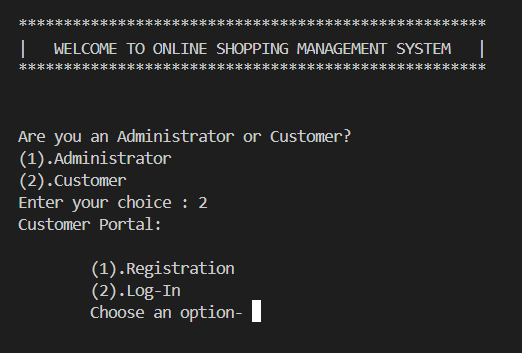
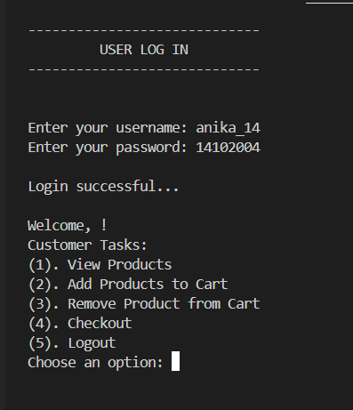
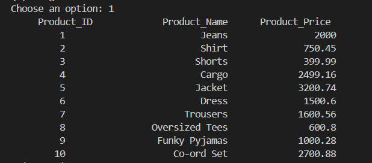
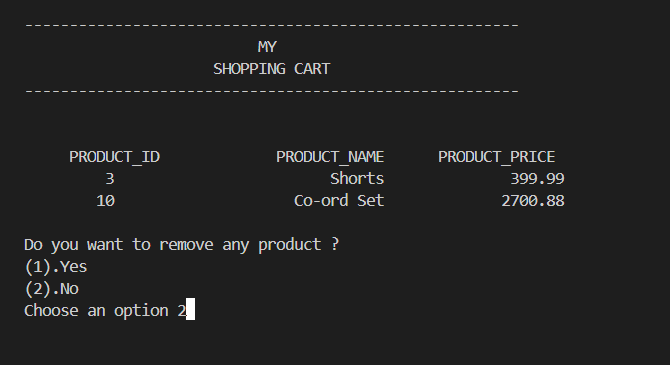
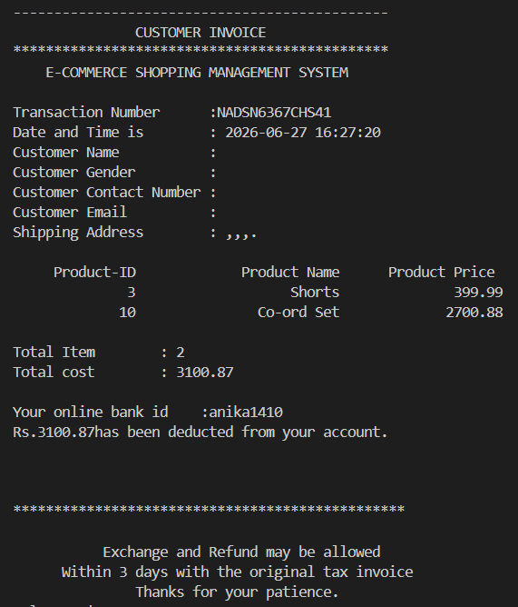

# Online Shopping Management System

## Project Overview

The Online Shopping Management System is a console-based application developed in C++ using Object-Oriented Programming (OOP) principles. The system simulates the core functionalities of an e-commerce platform by providing separate modules for administrators and customers, along with product management, shopping cart, payment processing, and invoice generation.

---

## Features

### Administrator Module
- Administrator authentication
- Add new products
- Remove existing products
- View available products

### Customer Module
- Customer registration
- Customer login
- Browse products
- Add products to shopping cart
- Remove products from shopping cart
- Checkout

### Payment Module
- Debit/Credit Card
- Online Banking
- UPI Payment
- Cash on Delivery (COD)

### Invoice Module
- Generates purchase invoice
- Displays purchased items
- Calculates total amount
- Displays payment details

---

## Object-Oriented Programming Concepts Used

- Classes and Objects
- Encapsulation
- Inheritance
- Polymorphism
- Aggregation
- Constructors and Destructors

---

## Technologies Used

- C++
- Standard Template Library (STL)
- File Handling
- Object-Oriented Programming

---

## Project Structure

```
Online-Shopping-Management-System
│
├── Online_Shopping_Management_System_.cpp
├── README.md
├── .gitignore
└── Screenshots
    ├── Home.png
    ├── Registration.png
    ├── Login.png
    ├── Products.png
    ├── Cart.png
    └── Invoice.png
```

---

## Screenshots

### Home



### Registration


### Login



### Product List



### Shopping Cart



### Invoice



---

## How to Run

### Prerequisites

- C++ Compiler (g++)
- Windows Operating System
- Visual Studio Code or any C++ IDE

### Compile

```bash
g++ Online_Shopping_Management_System_.cpp -o shopping
```

### Run

Windows

```bash
.\shopping
```

Linux/macOS

```bash
./shopping
```

---

## Future Enhancements

- Database integration using MySQL
- Graphical User Interface (GUI)
- Product search and filtering
- Order history
- Inventory management
- Secure authentication
- Online payment gateway integration

---

## Author

**Anika Dang**

This project was developed as part of an Object-Oriented Programming coursework to demonstrate the implementation of OOP concepts in a real-world console application.
